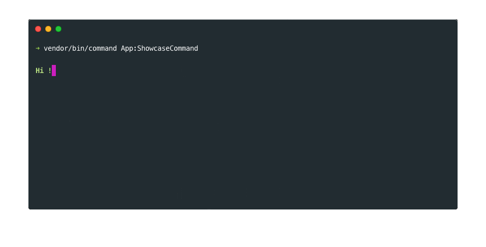

# SitPHP/Commands

](https://travis-ci.org/sitphp/commands)

[Read the full documentation here](https://sitphp.com/commands/doc/intro/latest)


## What is commands ?

The sitphp/commands library can help you to create commands super easily for your application or your library. You can also use it to build your own customized command tool.



## Install
Once you have composer installed, add the line `"sitephp/commands": "1.0.*"` in the `"require"` section of your composer.json file :
    
```json
{
    "require": {
        "sitephp/commands": "1.0.*"
    }
}
```